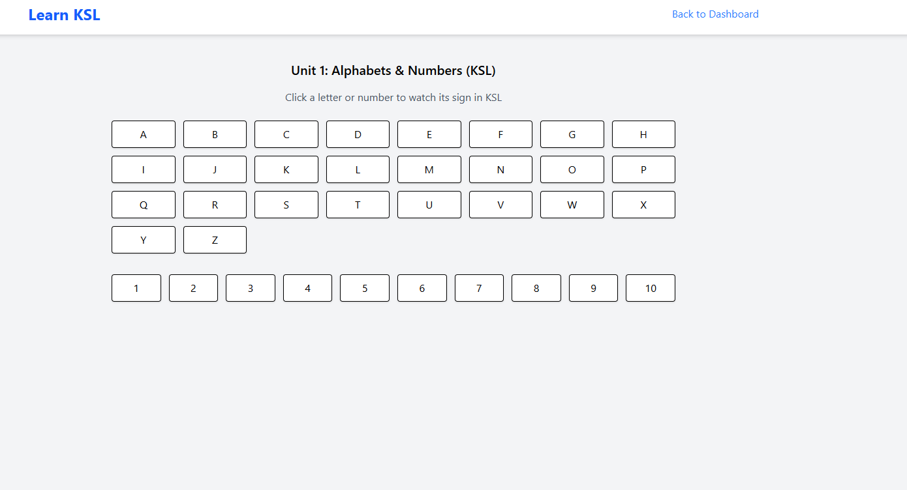

# Kenya Sign Language Learning Platform

A full-stack MERN application for learning Kenya Sign Language (KSL) with interactive lessons, AI-powered translation, and progress tracking.

## Features

### For Learners
- *Structured Learning Path*: 3 units covering alphabets, numbers, words, and phrases
- *Interactive Video Lessons*: Learn through visual demonstrations
- *AI Translation*: Convert text/voice to sign language demonstrations
- *Progress Tracking*: Monitor learning progress and achievements
- *Quiz System*: Test knowledge with interactive quizzes
- *Achievement System*: Unlock badges as you progress

### For Administrators
- *Content Management*: Add, edit, and delete learning content
- *Quiz Management*: Create and manage quiz questions
- *User Analytics*: Track user progress and engagement
- *Video Upload*: Upload sign language demonstration videos

## Technology Stack

### Backend
- *Node.js* with Express.js
- *MongoDB* with Mongoose
- *JWT* for authentication
- *Multer* for file uploads
- *bcryptjs* for password hashing

### Frontend
- *React* with functional components and hooks
- *React Router* for navigation
- *Axios* for API calls
- *Lucide React* for icons
- *CSS* for styling (no external CSS frameworks)

## Installation

### Prerequisites
- Node.js (v14 or higher)
- MongoDB (local or cloud)
- npm or yarn

### Setup Instructions

1. *Clone the repository*
   \\\`bash
   git clone <repository-url>
   cd ksl-learning-app
   \\\`

2. *Install dependencies*
   \\\`bash
   # Install server dependencies
   npm install

   # Install client dependencies
   cd client
   npm install
   cd ..
   \\\`

3. *Environment Configuration*
   Create a .env file in the server directory:
   \\\`env
   MONGODB_URI=mongodb://localhost:27017/ksl-learning
   JWT_SECRET=your-super-secret-jwt-key-here
   PORT=5000
   \\\`

4. *Create upload directories*
   \\\`bash
   mkdir -p server/uploads/videos
   mkdir -p server/uploads/quiz
   \\\`

5. *Seed the database*
   \\\`bash
   node scripts/seed-database.js
   \\\`

6. *Start the application*
   \\\`bash
   # Development mode (runs both server and client)
   npm run dev

   # Or run separately
   npm run dev  # Backend only
   npm run dev  # Frontend only
   \\\`

## Usage

### Test Accounts
After seeding the database, you can use these test accounts:

- *Admin*: real@example.com / admin123
- *Learner*: estherwgatuati@gmail.com / 1212

### Learning Path
1. *Unit 1: Basics* - Learn alphabets (A-Z) and numbers (0-9)
2. *Unit 2: Words* - Common vocabulary and everyday words
3. *Unit 3: Phrases* - Complete phrases and sentences

### Admin Features
- Access admin dashboard at /admin
- Manage content in Content Manager
- Create quiz questions in Quiz Manager
- Upload video files for demonstrations

## API Endpoints

### Authentication
- POST /api/auth/register - User registration
- POST /api/auth/login - User login
- GET /api/auth/me - Get current user

### Content
- GET /api/content/unit/:unitNumber - Get content by unit
- GET /api/content/search - Search content
- POST /api/content - Create content (admin)
- PUT /api/content/:id - Update content (admin)
- DELETE /api/content/:id - Delete content (admin)

### Quiz
- GET /api/quiz - Get all quiz questions
- POST /api/quiz/submit - Submit quiz answer
- POST /api/quiz/admin - Create quiz question (admin)
- PUT /api/quiz/admin/:id - Update quiz question (admin)
- DELETE /api/quiz/admin/:id - Delete quiz question (admin)

### Progress
- POST /api/progress/update - Update user progress
- GET /api/progress - Get user progress

## File Structure

\\\`
ksl-learning-app/
├── frontend/                 # React frontend
│   ├── public/
│   │   │   ├── gifs/  
│   │   │   └── videos/      
│   │    
│   ├── src/
│   │   ├── components/
│   │   │   ├── Admin/  
                 └── AdminDashboard.jsx    
│   │   │   ├── AskAI/ 
                 └── AskAIjsx   
│   │   │   └── Auth/  
                 └── Login.jsx  
                 └── Register.jsx     
            ├── Common/   
                 └── SearchBar.jsx  
                 └── VideoModal.jsx      
│   │   │   ├── Dashboard/  
                 └── Dashboard.jsx  
│   │   │   └── Layout/   
                   └── Navbar.jsx     
            ├── Learn/ 
                  └── Learn.jsx  
                  └── unit1.jsx  
                  └── unit2.jsx  
                  └── unit3.jsx  
                  └── videoplayer.jsx        
│   │   │   ├── Profile/ 
                 └── profile.jsx   
│   │   │   └── Quiz/  
                   └── quiz.jsx      
            ├── ProtectedAdminRoute.jsx         
│   │   ├── context/  
               └── AuthContext.jsx   
│   └── App.jsx
    ├── main.jsx       
│   ├── package-lock.json  
│   └── vite.config.js    
│   └── package.json
├── server/                 # Express backend
│   ├── config/  
           └── db.js          
    ├── models/ 
           └── content.js
           └── quiz.js
           └── user.js
           └── video.js  
│   ├── routes/            # API routes
         └── admin.js
         └── ai.js
         └── auth.js
         └── authRoutes.js
         └── content.js
         └── quiz.js
         └── quizroutes.js
         └── userroutes.js
         └── videos.js
│   ├── middleware/        # Custom middleware
         └── auth.js
         └── authMiddleware.js
         └── isAdmin.js
         └── roleMiddleware.js
│            # File uploads
    ├── controllers/ 
         └── ai.js  
         └── aicontroller.js
         └── auth.js
         └── authcontroller.js
         └── content.js
         └── quiz.js
         └── quizcontroller.js
         └── usercontroller.js
│   └── server.js
    ├── scripts/               # Utility scripts
│       └── seedvideos.js
    ├── utils/  
        └── validation.js 
└── package.json
├── packagelock.json/   
├── .env/   
\\\`

## Contributing

1. Fork the repository
2. Create a feature branch
3. Make your changes
4. Add tests if applicable
5. Submit a pull request

## Support

For support or questions, please contact the development team or create an issue in the repository.

screenshots

<video controls src="bandicam 2025-07-24 15-55-17-183.mp4" title="Title"></video>
<video controls src="bandicam 2025-07-24 16-08-10-997.mp4" title="Title"></video>

link: https://ksl-learning-app-frontend.onrender.com

